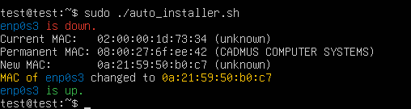

# Randomizer

Randomizer, which configures and randomizes MAC addresses periodically to enhance privacy and security.
This script allows you to randomize the MAC addresses of your network interfaces, either manually or through an automated installation process that sets up everything you need, including a systemd service and a cron job.

## How to use it!

### Manual

To quickly execute the script without installing any additional services, you can use the manual script. This will randomize the MAC addresses of your network interfaces immediately.

´´´sh
wget -qO- https://raw.githubusercontent.com/4p0f1s/Randomizer/main/manual_randomizer.sh | sudo bash
´´´

### Auto-installer

For a more persistent solution, you can use the auto-installer.
This script will:

1. Check if the script is being run as root.
2. Verify if the necessary dependencies (ip and optionally macchanger) are installed.
3. If macchanger is not installed, the script will ask you if you want to install it or use only ip commands for randomizing MAC addresses.
4. If you choose to use only ip, this preference will be stored, so future executions of the script will remember this choice. If you later want to install macchanger, you can pass the install parameter to force the installation.
5. Depending on your choice, the script will randomize the MAC addresses using the appropriate method.
6. The script will create a systemd service that ensures MAC addresses are randomized on every reboot.
7. It will also set up a cron job to randomize MAC addresses at a specified interval. The script will prompt you for the cron expression to ensure proper formatting.
8. Finally, the installation and configuration will be completed, and the MAC randomization will be automated.

Only with ip:

With Macchanger:

### Uninstall

If you need to remove everything that was installed by the auto-installer, you can use the uninstaller script.
This will:

1. Stop and remove the systemd service created for MAC randomization.
2. Remove the configuration files stored in /etc/randomizer.
3. Delete the script from /usr/local/bin that was used to randomize the MAC addresses.
4. Remove the cron job that was scheduled for periodic MAC randomization.
5. Optionally, uninstall macchanger if it was installed by the auto-installer.

