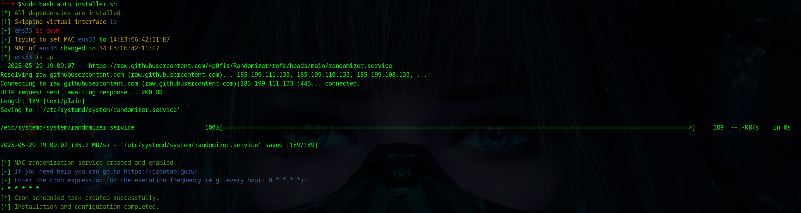

<h1 align="center">Randomizer</h1>

<p align="center">
  <a href="https://github.com/4p0f1s/Randomizer/stargazers"></a>
  <a href="https://github.com/4p0f1s/Randomizer/forks"></a>
  
  
</p>

## Table of Contents

- [Introduction](#Introduction)
- [How to use it!](#How to use it!)
  -  [Insta-Randomizer](#Insta-Randomizer)
  -  [Auto-installer](#Auto-installer)
  -  [Uninstall](#Uninstall)
- [License](#License)

# Introduction

Randomizer, which configures and randomizes MAC addresses periodically to enhance privacy and security.
This script allows you to randomize the MAC addresses of your network interfaces, either manually or through an automated installation process that sets up everything you need, including a systemd service and a cron job.

## How to use it!

### Insta-Randomizer

To quickly execute the script without installing any additional services, you can use the manual script. This will randomize the MAC addresses of your network interfaces immediately.

```sh
wget -qO- https://raw.githubusercontent.com/4p0f1s/Randomizer/main/insta_randomizer.sh | sudo bash
```
If you want you can also run it with `--quiet` or `-q` to suppress output (useful for automation):
```sh
wget -qO- https://raw.githubusercontent.com/4p0f1s/Randomizer/main/insta_randomizer.sh | sudo bash -s -- -q
```

---

### Auto-installer

```sh
wget -q https://raw.githubusercontent.com/4p0f1s/Randomizer/main/auto_installer.sh
chmod +x auto_installer.sh
sudo ./auto_installer.sh
```

For a more persistent solution, you can use the auto-installer.
This script will:

1. Check if the script is being run as root.
2. Verify if the required dependency (`ip`) is installed (`iproute2` package).
3. Randomize the MAC addresses of all physical network interfaces.
4. Set up a systemd service to randomize MAC addresses at boot using `--randomize`.
5. Prompt you to create a cron job to randomize MAC addresses at the interval you define.

> The script only uses native `ip` commands (`iproute2`) to change MAC addresses — no external tools like `macchanger` are required.

Only with `ip`:



### Uninstall

If you need to remove everything that was installed by the auto-installer, you can use the uninstaller script.
This will:

1. Stop and remove the systemd service created for MAC randomization. 
2. Delete the script from `/usr/local/bin` that was used to randomize the MAC addresses. 
3. Remove the cron job that was scheduled for periodic MAC randomization.


## License

Randomizer is released under the GPL-3.0 License. See the [LICENSE](https://github.com/4p0f1s/Randomizer/blob/main/LICENSE) file for details.

